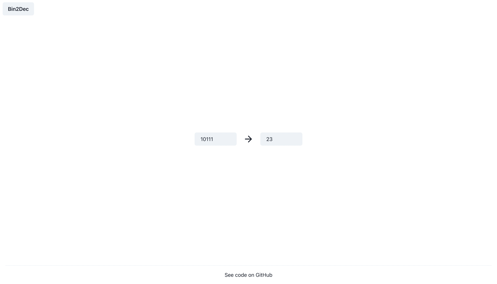

<h1 align="center">Welcome to Bin2Dec 👋</h1>

  
  

> A React Web App that convert binary values into decimal.

### 🏠 [Homepage](https://bin2dec-lucasvbr.vercel.app/)

<kbd>
    
</kbd>

## Description

Binary is the number system all digital computers are based on.
Therefore, it's important for developers to understand binary, or base 2,
mathematics. The purpose of Bin2Dec is to provide practice and
understanding of how binary calculations.

Bin2Dec allows the user to enter strings of up to 8 binary digits, 0's
and 1's, in any sequence and then displays its decimal equivalent.

This challenge requires that the developer implementing it follow these
constraints:

- Arrays may not be used to contain the binary digits entered by the user
- Determining the decimal equivalent of a particular binary digit in the
  sequence must be calculated using a single mathematical function, for
  example the natural logarithm. It's up to you to figure out which function
  to use.

#### User Stories

-   [X] User can enter up to 8 binary digits in one input field
-   [ ] User must be notified if anything other than a 0 or 1 was entered
-   [X] User views the results in a single output field containing the decimal (
    base 10) equivalent of the binary number that was entered

#### Bonus features

-   [X] User can enter a variable number of binary digits

From <a href="https://github.com/florinpop17/app-ideas">app-ideas</a>/<a href="https://github.com/florinpop17/app-ideas/blob/master/Projects/1-Beginner/Bin2Dec-App.md">Bin2Dec-App</a> 

## Author

👤 **LucasVbr**

* Github: [@LucasVbr](https://github.com/LucasVbr)
* LinkedIn: [@lucasvbr](https://linkedin.com/in/lucasvbr)

## Show your support

Give a ⭐️ if this project helped you!

## 📊 Project Stats

## 📝 License

Copyright © 2022 [LucasVbr](https://github.com/LucasVbr). 
This project is under the [Unlicense](https://unlicense.org/).

<!-- _This README was generated with ❤️ by [readme-md-generator](https://github.com/kefranabg/readme-md-generator)_ -->
